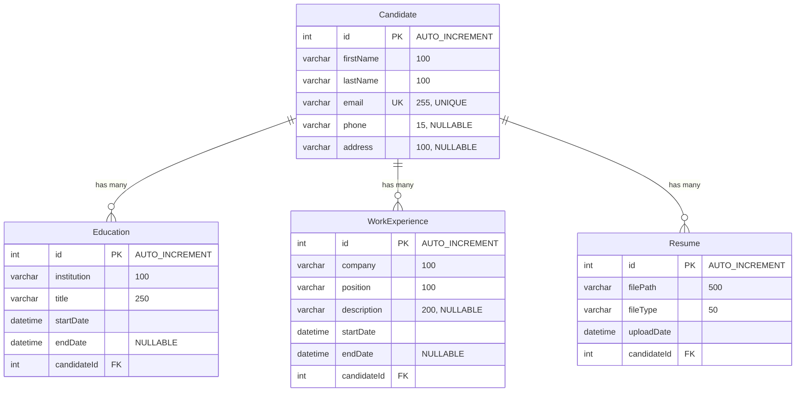

# Diagrama ERD - Base de Datos de Candidatos

## Análisis del Esquema

Este esquema de Prisma define un sistema de gestión de candidatos con las siguientes características:

### Entidades Principales

1. **Candidate** - Entidad principal que representa a un candidato
2. **Education** - Historial educativo de los candidatos
3. **WorkExperience** - Experiencia laboral de los candidatos
4. **Resume** - Archivos de currículum asociados a los candidatos

### Relaciones

- **Candidate → Education**: Relación uno-a-muchos (un candidato puede tener múltiples registros educativos)
- **Candidate → WorkExperience**: Relación uno-a-muchos (un candidato puede tener múltiples experiencias laborales)
- **Candidate → Resume**: Relación uno-a-muchos (un candidato puede tener múltiples currículums)

## Diagrama ERD

## Descripción Detallada de las Entidades

### Candidate (Candidato)
- **Propósito**: Almacena la información personal básica de los candidatos
- **Campos Clave**:
  - `id`: Identificador único autoincremental
  - `email`: Email único del candidato (constraint UNIQUE)
  - `firstName`, `lastName`: Nombre y apellido del candidato
  - `phone`, `address`: Campos opcionales para contacto y ubicación

### Education (Educación)
- **Propósito**: Registra el historial educativo de los candidatos
- **Campos Clave**:
  - `id`: Identificador único autoincremental
  - `candidateId`: Clave foránea que referencia a Candidate
  - `institution`: Nombre de la institución educativa
  - `title`: Título o grado obtenido
  - `startDate`: Fecha de inicio (obligatoria)
  - `endDate`: Fecha de finalización (opcional, permite educación en curso)

### WorkExperience (Experiencia Laboral)
- **Propósito**: Almacena la experiencia laboral de los candidatos
- **Campos Clave**:
  - `id`: Identificador único autoincremental
  - `candidateId`: Clave foránea que referencia a Candidate
  - `company`: Nombre de la empresa
  - `position`: Cargo o posición ocupada
  - `description`: Descripción opcional de las responsabilidades
  - `startDate`: Fecha de inicio (obligatoria)
  - `endDate`: Fecha de finalización (opcional, permite trabajos actuales)

### Resume (Currículum)
- **Propósito**: Gestiona los archivos de currículum subidos por los candidatos
- **Campos Clave**:
  - `id`: Identificador único autoincremental
  - `candidateId`: Clave foránea que referencia a Candidate
  - `filePath`: Ruta del archivo en el sistema de almacenamiento
  - `fileType`: Tipo de archivo (PDF, DOC, etc.)
  - `uploadDate`: Fecha y hora de carga del archivo

## Características del Esquema

### Constraints y Validaciones
- **Email único**: El campo `email` en Candidate tiene constraint UNIQUE, garantizando que no haya duplicados
- **Claves foráneas**: Todas las relaciones están definidas con foreign keys que aseguran integridad referencial
- **Campos opcionales**: Varios campos permiten valores NULL para flexibilidad (phone, address, endDate, description)

### Tipos de Datos
- **PostgreSQL**: El esquema utiliza PostgreSQL como base de datos
- **VarChar con límites**: Todos los campos de texto tienen límites específicos para optimizar el almacenamiento
- **DateTime**: Fechas almacenadas como DateTime para precisión temporal

### Relaciones
- **Cascada implícita**: Las relaciones están configuradas para mantener la integridad referencial
- **Cardinalidad**: Todas las relaciones son uno-a-muchos (1:N), permitiendo múltiples registros relacionados por candidato

## Consideraciones de Diseño

1. **Normalización**: El esquema está bien normalizado, separando información personal, educativa, laboral y archivos
2. **Escalabilidad**: Permite múltiples registros por candidato en cada entidad relacionada
3. **Flexibilidad**: Campos opcionales permiten datos incompletos sin comprometer la integridad
4. **Trazabilidad**: El campo `uploadDate` en Resume permite rastrear cuándo se subieron los archivos

